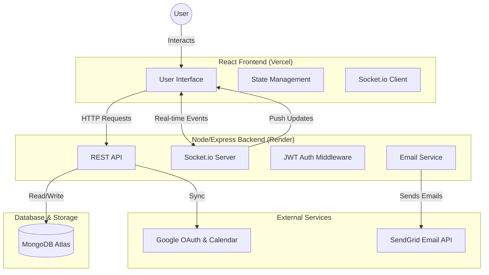

# Task Management Web Application (Major Project Edition 🚀)

## 🌐 Live Demo
- **Frontend (Vercel):** [https://mega-project-8-task-management-web.vercel.app/](https://mega-project-8-task-management-web.vercel.app/)
- **Backend (Render):** [https://task-manager-backend-aa5y.onrender.com/](https://task-manager-backend-aa5y.onrender.com/)

A full-stack task management application built with **React**, **Node.js**, **Express**, and **MongoDB**. This project has been upgraded to "Major Project" status with real-time capabilities and advanced features.

## 🏗️ System Architecture


## 🌟 Key Features

### Core
- **User Authentication**: Secure JWT-based signup/login.
- **Task Management**: CRUD operations with Mongoose.
- **Advanced Filtering**: Status, Priority, Search.

### 🚀 Major Project Features (New!)
- **⚡ Real-Time Updates**: Powered by **Socket.io**. Changes (create/edit/delete) appear instantly across devices.
- **📊 Analytics Dashboard**: Visual charts (Pie/Bar) using **Recharts** to track productivity.
- **📋 Kanban Board**: Trello-style **Drag & Drop** interface (`@hello-pangea/dnd`) for managing task status.
- **🖼️ Profile Avatars**: Image upload functionality using **Multer**.
- **📅 Google Calendar Sync**: Bidirectional task synchronization using **Google OAuth 2.0**.
- **📧 Email Notifications**: Automated welcome emails and task alerts using **Nodemailer**.
- **📄 Pagination**: API supports `?limit` and `?skip` for handling large datasets.

## 🛠️ Tech Stack

- **Frontend**: React (Vite), Socket.io Client, Recharts, Hello Pangea DnD, Axios.
- **Backend**: Node.js, Express.js, Socket.io, MongoDB (Atlas), Multer, Nodemailer.

## ⚙️ Setup Instructions

### 1. Database & Environment
1. Ensure your `.env` file has the MongoDB URI (Atlas or Local).
   ```bash
   MONGO_URI=mongodb+srv://...
   JWT_SECRET=...
   ```
2. (Optional) Email Configuration in `.env` for real emails:
   ```
   SMTP_HOST=smtp.mailtrap.io
   SMTP_PORT=2525
   SMTP_EMAIL=...
   SMTP_PASSWORD=...
   ```

### 2. Start Application
**Backend** (Terminal 1):
```bash
npm start
```
*Server runs on port 5000 with WebSocket enabled.*

**Frontend** (Terminal 2):
```bash
cd frontend
npm run dev
```
*Client runs on http://localhost:5173*

## 📡 API Endpoints (New)

- **POST** `/api/auth/me/avatar` - Upload profile picture (Multipart/Form-Data).
- **GET** `/api/auth/:id/avatar` - Retrieve user avatar.
- **GET** `/api/tasks?limit=10&skip=0` - Paginated task list.

## ⚠️ Known Limitations (Google Calendar)
The app is currently in **Google OAuth Testing Mode**. 
- To use the Google Calendar Sync feature, your email address MUST be manually added to the **Test Users** list in the Google Cloud Console.
- Users not in the test list will face an **"Access Blocked"** error.
- **Why?** Google requires a strict verification process (4-6 weeks) for apps accessing sensitive scopes like Calendar in production. For this project/demo, we are using Testing Mode.

## 📂 Project Structure

```
├── backend/
│   ├── src/
│   │   ├── services/       # Email Service
│   │   ├── controllers/    # Logic (Auth, Task, Avatar)
│   │   ├── models/         # User (Buffer Avatar), Task
│   │   └── server.js       # HTTP + Socket.io Server
├── frontend/
│   ├── src/
│   │   ├── components/
│   │   │   ├── Dashboard/  # Analytics Charts
│   │   │   ├── Tasks/      # Kanban & List Views
